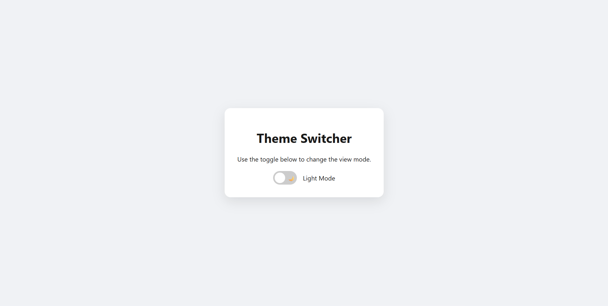

# Project 3 - Dark / Light Mode Toggle

A clean and interactive Theme Switcher built using HTML, CSS, and JavaScript.  
This project allows users to toggle between Light and Dark modes seamlessly, with a focus on smooth transitions and persistent settings.

---

## 📸 Preview

  

---

## 📌 Features

- 🌓 **Theme Toggle**: Switch between light and dark modes with a custom-designed toggle.
- 🎨 **Dynamic Styling**: Changes global colors and background styles instantly using JavaScript.
- 💾 **Persistent Preference**: Automatically saves the user's last chosen theme in `localStorage`.
- ✨ **Smooth Transitions**: Uses CSS transitions for a pleasing visual effect when switching modes.
- 🌙 **Creative Icons**: Custom icons (Sun/Moon) to represent each theme beautifully.

---

## ⚙️ How It Works

- **Dynamic Theme Swap**: JavaScript targets the root element or body class to swap CSS variables for colors.
- **LocalStorage Integration**: 
  - On page load, the app checks for a saved theme preference.
  - If a preference exists, it applies it automatically before the page renders fully.
- **Smooth Animation**: A `transition` property is applied to backgrounds and text colors to avoid harsh flickering during the switch.
- **Interactive UI**: The toggle switch is built with a hidden checkbox or button, styled for a modern look.

---

## 🛠 Tech Stack

- **HTML5**: Base structure and toggle elements.
- **CSS3**: Variables (Custom Properties) and smooth transition effects.
- **JavaScript**: Theme logic and `localStorage` integration.

---

## 👩‍💻 Author

Created by **Ummu Husnul**
